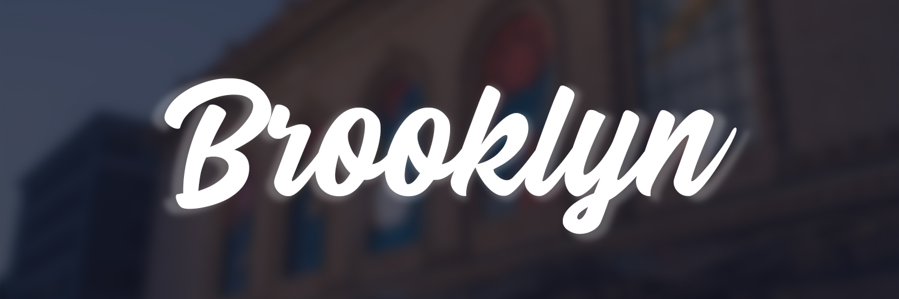
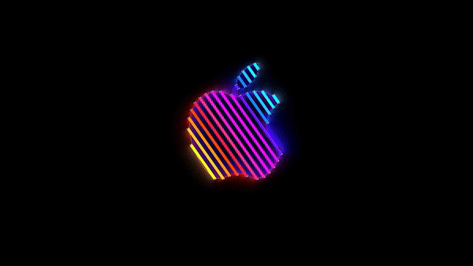

# Brooklyn

[English](./README.md) | 日本語

<div align="center">
  
</div>

[Apple の 2018 年 Brooklyn イベント](https://www.apple.com/newsroom/2018/10/highlights-from-apples-keynote-event/)にインスパイアされた macOS スクリーンセーバー。

<br>
<div align="center">
  
</div>
<br>

75 種類の美しい Apple ロゴアニメーションが画面でループし続けます。

[Pedro Carrasco のオリジナル Brooklyn](https://github.com/pedrommcarrasco/Brooklyn) を Swift 6 / macOS 26 (Tahoe) / Apple Silicon 向けに再実装したものです。

## Requirements

- macOS 26 (Tahoe) 以降
- Apple Silicon (arm64)

## Install

### Homebrew

```sh
brew install nozomiishii/tap/brooklyn
```

Brooklyn アプリを一度起動するとスクリーンセーバー extension が登録されます。**システム設定 > 壁紙 > スクリーンセーバ** で **Brooklyn** を選択してください。

## Uninstall

```sh
brew uninstall nozomiishii/tap/brooklyn
```

## Customization

**システム設定 > 壁紙 > スクリーンセーバ** で **Brooklyn** を選択し、**Options…** をクリックします。

- **Customize OFF（デフォルト）**: オリジナルの Apple ロゴアニメーションを最初に再生したあと、残りの 74 種をシャッフルして無限ループします
- **Customize ON**: お気に入りのアニメーションを選んで、ループ回数やシャッフル順を設定できます

## 謝辞

Brooklyn はこれらの素晴らしいプロジェクトなしには存在しませんでした。Screen Saver中のMacも美しいです。

- [Brooklyn by Pedro Carrasco](https://github.com/pedrommcarrasco/Brooklyn) オリジナルの Brooklyn スクリーンセーバー。伝説的です。
- [Apple の Brooklyn イベント (2018)](https://www.apple.com/newsroom/2018/10/highlights-from-apples-keynote-event/) 同時期にあった[Apple 渋谷のリニューアルオープンビデオ](https://www.youtube.com/watch?v=30rXa448tGA)とも重なって[ANIMAL HACKさんのFranny](https://open.spotify.com/track/31a06sRIW6qMMfONkhl9yR)がずっと脳内再生されてます。思い出深いです。しみじみです。

## License

[MIT](LICENSE)
