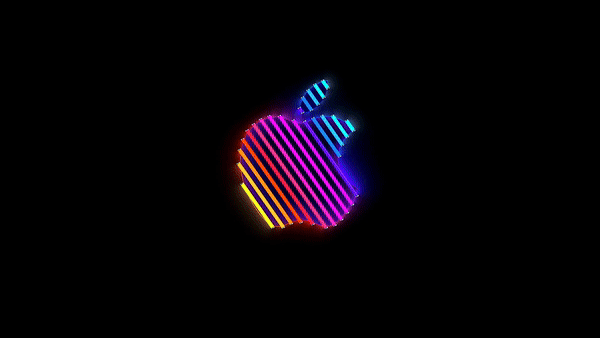

# Brooklyn

English | [日本語](./README.ja.md)

<br>
<div align="center">
  
</div>
<br>

A macOS screen saver inspired by [Apple's 2018 Brooklyn event](https://www.apple.com/newsroom/2018/10/highlights-from-apples-keynote-event/). 75 mesmerizing Apple logo animations looping endlessly on your screen.

A reimplementation of [Pedro Carrasco's original Brooklyn](https://github.com/pedrommcarrasco/Brooklyn), rebuilt for Swift 6, macOS 26 (Tahoe), and Apple Silicon.

## Requirements

- macOS 26 (Tahoe) or later
- Apple Silicon (arm64)

## Install

### Homebrew

```sh
brew install nozomiishii/tap/brooklyn
```

## Uninstall

```sh
brew uninstall nozomiishii/tap/brooklyn
```

## Customization

Open **System Settings > Screen Saver > Brooklyn** and click the options button.

- **Customize OFF (default)**: Plays the original Apple logo animation first, then shuffles the remaining 74 and loops endlessly
- **Customize ON**: Pick your favorite animations and control the loop count and shuffle order

## Acknowledgments

Brooklyn wouldn't exist without these amazing projects. Your Mac looks beautiful even during screen saver time.

- [Brooklyn by Pedro Carrasco](https://github.com/pedrommcarrasco/Brooklyn) The original Brooklyn screen saver. Truly legendary.
- [Apple's Brooklyn event (2018)](https://www.apple.com/newsroom/2018/10/highlights-from-apples-keynote-event/) It overlaps in my memory with the [Apple Shibuya reopening video](https://www.youtube.com/watch?v=30rXa448tGA) from the same time, and [ANIMAL HACK's Franny](https://open.spotify.com/track/31a06sRIW6qMMfONkhl9yR) keeps playing in my head. Full of memories. Deeply nostalgic.

## License

[MIT](LICENSE)
